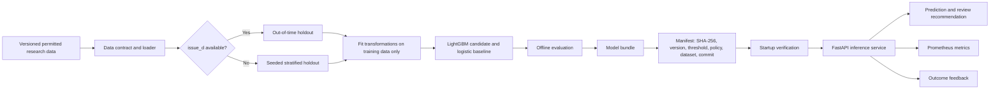
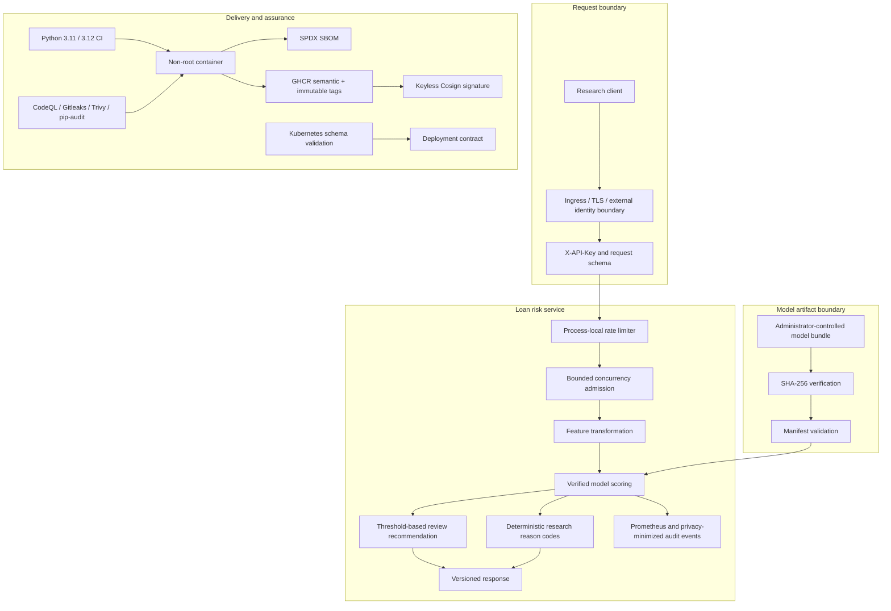

# Loan Default Risk Predictor

[](https://github.com/CoreyLeath-code/LoanDefaultRiskPredictor/actions/workflows/ci.yml)
[](https://github.com/CoreyLeath-code/LoanDefaultRiskPredictor/actions/workflows/security.yml)
[](https://github.com/CoreyLeath-code/LoanDefaultRiskPredictor/actions/workflows/codeql.yml)
[](https://github.com/CoreyLeath-code/LoanDefaultRiskPredictor/actions/workflows/container-scan.yml)
[](https://github.com/CoreyLeath-code/LoanDefaultRiskPredictor/actions/workflows/release.yml)
[](https://github.com/CoreyLeath-code/LoanDefaultRiskPredictor/releases)
[](.github/workflows/ci.yml)
[](pyproject.toml)
[](LICENSE)

**Loan Default Risk Predictor** is a research-oriented LightGBM training pipeline and model-backed FastAPI service for studying loan-default risk ranking. The repository emphasizes traceable model artifacts, explicit data/evaluation contracts, fail-closed serving, operational controls, and evidence-backed delivery.

> [!CAUTION]
> This repository is **not an approved credit-decision system**. It must not be used to approve, decline, price, limit, collect, or otherwise determine credit eligibility without representative-data validation, model-risk review, fair-lending analysis, calibration review, privacy/legal approval, human oversight, and deployment-specific security controls.

## What is actually proven

The repository separates **engineering evidence** from **model-quality evidence**. CI can prove that code, artifact verification, container delivery, and synthetic smoke inference satisfy stated contracts. It cannot prove that a credit-risk model is accurate, fair, calibrated, or legally suitable for real lending without an approved representative dataset.

### Audited engineering baseline

The pre-v0.2.0 main baseline at commit `cbf5ee6f0524b98f1616ba4e0b75f192462cdccd` established:

| Evidence | Audited result | Scope |
|---|---:|---|
| Tests | 20 / 20 passed | API, artifacts, benchmark contract, data contract, research metrics, training pipeline |
| Branch coverage | 81.79% | `src`, `api`, and `evaluation` on Python 3.11 |
| Static analysis | Ruff + mypy passed | Repository critical paths / API typing |
| Security lint | Bandit passed | `api`, `src`, `evaluation` |
| Runtime dependency audit | No known vulnerabilities | `requirements/runtime.txt` at the audited run |
| Deployment validation | Passed | non-root image, read-only smoke run, verified model readiness, Compose, Kubernetes schema |
| Security workflows | Passed | repository scanning and CodeQL on the audited main commit |

The v0.2.0 audit raises the enforced coverage floor from 75% to **80%** and adds a CI-generated benchmark evidence artifact. Release evidence is generated by `.github/workflows/release.yml` and includes the source commit, immutable image digest, SPDX SBOM, Cosign signature, and release checksums.

## Implemented capabilities

- Leakage-conscious feature engineering with training-only fitted transformations and identifier exclusion.
- LightGBM candidate training with seeded Optuna tuning and logistic-regression baseline comparison.
- Out-of-time holdout preference when `issue_d` exists, with explicit seeded stratified fallback.
- Versioned model bundles with SHA-256 verification, threshold, policy version, dataset identifier, model version, and training commit.
- Strict probability contract: non-finite or out-of-range model outputs fail rather than being silently clamped.
- Model-backed `POST /predict`; production startup fails closed when authentication or verified model artifacts are unavailable.
- Strict Pydantic request validation, deterministic research reason-code placeholders, API-key support, local rate limiting, bounded concurrency, security headers, readiness, and Prometheus metrics.
- Offline ROC-AUC, PR-AUC, Brier score, log loss, **sample-weighted expected calibration error**, operating-point metrics, confusion counts, and seeded ROC-AUC bootstrap interval.
- Container/Kubernetes validation, CodeQL, Gitleaks, Trivy, runtime dependency audit, SPDX SBOM generation, GHCR publishing, and keyless Cosign image signing.

## Architecture flowchart



## System design flowchart



### Failure policy

The service intentionally fails closed at important boundaries:

- Production mode without `LOAN_RISK_API_KEY` fails startup.
- A missing, malformed, path-invalid, or checksum-mismatched model bundle prevents readiness and fails startup in production.
- Unknown request fields or invalid values return validation errors.
- Invalid feature transformations fail the request.
- Non-finite or out-of-range model probabilities fail scoring with a sanitized service error.
- Exhausted inference admission returns a service-unavailable response instead of creating unbounded work.

## Quick start

Python **3.11 and 3.12** are CI-supported.

```bash
git clone https://github.com/CoreyLeath-code/LoanDefaultRiskPredictor.git
cd LoanDefaultRiskPredictor
python -m venv .venv
. .venv/bin/activate
python -m pip install --upgrade pip
python -m pip install -r requirements/dev.txt
```

Windows PowerShell activation:

```powershell
.\.venv\Scripts\Activate.ps1
```

Run the same core quality checks enforced in CI:

```bash
ruff check api src evaluation tests scripts benchmarks
mypy api --ignore-missing-imports
bandit -q -r api src evaluation -x tests -ll
python -m compileall -q api src evaluation tests scripts benchmarks
pytest --cov --cov-report=term-missing --cov-fail-under=80
pip-audit --requirement requirements/runtime.txt
```

### Run the research API with a deterministic smoke bundle

The smoke bundle proves artifact and serving plumbing only. It is **not** a validated lending model.

```bash
python -m scripts.build_smoke_bundle --output models/ci
export MODEL_BUNDLE_PATH=models/ci
export LOAN_RISK_API_KEY=local-dev
uvicorn api.inference_api:app --host 127.0.0.1 --port 8000
```

PowerShell:

```powershell
python -m scripts.build_smoke_bundle --output models/ci
$env:MODEL_BUNDLE_PATH = "models/ci"
$env:LOAN_RISK_API_KEY = "local-dev"
uvicorn api.inference_api:app --host 127.0.0.1 --port 8000
```

Check readiness:

```bash
curl http://127.0.0.1:8000/healthz
curl http://127.0.0.1:8000/readyz
```

## API contract

| Endpoint | Purpose | Authentication |
|---|---|---|
| `GET /healthz` | Process liveness | none in application |
| `GET /readyz` | Verified model-bundle readiness | none in application |
| `GET /metrics` | Prometheus exposition | none in application; restrict at deployment boundary |
| `POST /predict` | Model-backed research prediction | `X-API-Key` when configured |
| `POST /feedback` | Record observed research outcome | `X-API-Key` when configured |

A successful prediction is a **research risk signal and review recommendation**, not an approval, denial, pricing decision, adverse-action notice, or compliance determination.

## Reproducibility and hard evidence

### Offline model evaluation

A model-quality result is eligible for comparison only when the dataset, source commit, split protocol, threshold, and environment are retained. `src.train` writes `outputs/metrics.json` and a checksummed bundle manifest.

```bash
git rev-parse HEAD
python -m src.train \
  --uri /path/to/versioned-loans.csv \
  --trials 20 \
  --seed 2025 \
  --test-size 0.2 \
  --threshold 0.5 \
  --output models/candidate \
  --metrics-output outputs/metrics.json \
  --model-version candidate-local
```

The record includes:

- dataset fingerprint or explicit external-source identifier;
- source training commit;
- split method and row counts;
- seed, test fraction, Optuna trial count, and decision threshold;
- Python, pandas, scikit-learn, and LightGBM versions;
- candidate and logistic-baseline metrics;
- training wall-clock time;
- explicit limitations.

Dependency files use **bounded version ranges**, not a hash-locked environment. The repository therefore claims a reproducible procedure and recorded environment—not byte-for-byte dependency reproduction.

### Model artifact integrity

`src.artifacts.load_bundle` verifies the manifest and SHA-256 checksum **before** deserializing the joblib model. This is an integrity check, not a trust substitute: only administrator-controlled model paths are supported.

### Release evidence

The v0.2.0 publisher creates:

- `ghcr.io/coreyleath-code/loan-default-risk-predictor:v0.2.0`;
- `ghcr.io/coreyleath-code/loan-default-risk-predictor:sha-<12-char-commit>`;
- a keyless Cosign signature over the immutable image digest;
- `sbom.spdx.json`;
- `release-evidence.txt`;
- `release-checksums.txt`;
- an immutable GitHub Release tag `v0.2.0`.

The workflow refuses to overwrite an existing release tag.

## Research-style benchmarks and metrics

### Model-quality metrics

No dataset-specific model-quality number is published in this README because the repository does not bundle a representative approved lending dataset. The evaluator supports:

| Metric family | Metrics |
|---|---|
| Discrimination | ROC-AUC, PR-AUC |
| Probability quality | Brier score, log loss |
| Calibration | Sample-weighted expected calibration error |
| Uncertainty | Seeded bootstrap 95% interval for ROC-AUC |
| Operating point | Accuracy, precision, recall, F1, threshold, TN/FP/FN/TP |
| Baseline | Logistic regression on the same holdout |
| Slices | Offline group metrics only when the cohort has at least 30 observations and both target classes |

These metrics are descriptive research evidence. Acceptance thresholds require dataset-specific governance.

### Inference microbenchmark

```bash
python -m benchmarks.inference \
  --iterations 1000 \
  --warmup 100 \
  --output outputs/inference-benchmark.json
```

The benchmark records commit, environment, model checksum, synthetic input hash, warmup/sample count, mean/stdev/p50/p95/p99/min/max latency, sequential throughput, peak traced Python memory, and success count/rate.

**Scope:** batch-1 preprocessing plus local smoke-model inference in one Python process. It excludes HTTP, network, TLS, concurrency, queueing, representative LightGBM model behavior, availability, and production SLOs. Treating this microbenchmark as API capacity would be invalid.

See [`docs/BENCHMARKS.md`](docs/BENCHMARKS.md) for the benchmark evidence contract.

## Online telemetry

| Prometheus metric | Meaning | Labels |
|---|---|---|
| `loan_risk_requests_total` | Completed requests | `route`, `status` |
| `loan_risk_request_duration_seconds` | Request latency histogram | `route` |
| `loan_risk_in_flight` | Requests holding inference admission | none |
| `loan_risk_predictions_total` | Completed predictions | `review`, `model_version` |
| `loan_risk_feedback_total` | Accepted feedback | `outcome`, `model_version` |

Raw borrower feature values and governance-group identities must not be used as Prometheus labels.

## Engineering Q&A

**Why LightGBM?**  
It is the candidate model implemented by this repository. Its presence is not a claim that it is superior for a real lending population; the evaluation pipeline compares it with a logistic baseline on the same holdout.

**Why prefer an out-of-time split?**  
When dated observations are available, it better reflects the temporal direction of deployment than randomly mixing future and past observations. The fallback is explicit when `issue_d` is unavailable.

**Why is there no accuracy badge?**  
A model-quality badge without a versioned representative dataset, protocol, and artifact would be misleading. CI status and engineering evidence are allowed to be badges; lending-model performance is not.

**Are the reason codes explainability evidence?**  
No. They are deterministic placeholders for engineering review and are not demonstrated to be model-faithful or approved adverse-action reasons.

**Is the SHA-256 model manifest enough to trust a model?**  
No. It detects artifact changes relative to the manifest. Artifact provenance and authorization remain deployment/governance responsibilities.

**Is the API production-ready?**  
The repository demonstrates several production-oriented controls, but it intentionally does not claim complete production readiness. The limiter is process-local, application metrics are unauthenticated, there is no representative lending validation, and regulated deployment controls are environment-specific.

## Engineering roadmap

### P0 — model-evidence qualification

- Add a legally permitted, versioned dataset manifest without committing sensitive borrower data.
- Run candidate/baseline evaluation on a representative cohort and retain immutable metrics artifacts.
- Define calibration, discrimination, stability, subgroup, and threshold acceptance criteria with model-risk and fair-lending reviewers.
- Replace placeholder reason codes only after model-faithfulness and adverse-action review.

### P1 — distributed serving controls

- Move rate limiting/admission coordination to a shared gateway or distributed control plane for multi-replica deployments.
- Add external identity/authorization and restrict `/metrics` at the ingress/network boundary.
- Add OpenTelemetry traces with privacy-safe attributes.
- Add target-environment HTTP/concurrency/load tests and define SLOs/error budgets from representative traffic.

### P2 — reproducibility and supply chain

- Add a controlled hash-locked dependency build process for byte-level environment reproducibility.
- Add model-artifact provenance/signing in addition to checksum verification.
- Add deployment rollback exercises and release verification documentation.
- Add governed drift, calibration, and feedback-coverage monitoring once representative production-like data exists.

## L6 audit

The detailed engineering scorecard and remaining risks are documented in [`docs/AUDIT.md`](docs/AUDIT.md). The governing principle is simple: **README, code, CI, release artifacts, and model evidence must agree.**

## License

MIT. See [LICENSE](LICENSE).
