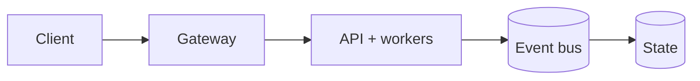

# Loan Default Risk Predictor

<p align="center"><strong>A governed, versioned LightGBM research pipeline with verified model-backed serving.</strong></p>

<p align="center">
  <a href="https://github.com/CoreyLeath-code/LoanDefaultRiskPredictor/actions/workflows/ci.yml"></a>
  <a href="https://github.com/CoreyLeath-code/LoanDefaultRiskPredictor/actions/workflows/container-scan.yml"></a>
  <a href="https://github.com/CoreyLeath-code/LoanDefaultRiskPredictor/actions/workflows/docker-publish.yml"></a>
  <a href="https://github.com/CoreyLeath-code/LoanDefaultRiskPredictor/actions/workflows/docs-deploy.yml"></a>
</p>

<p align="center">
  
  
  
  
  
  
  <a href="LICENSE"></a>
</p>

> **Important:** this is a production-candidate engineering demonstration, not an approved credit-decision system. It must not be used for lending decisions without representative-data validation, fair-lending and calibration review, privacy/legal approval, human oversight, and environment-specific security controls.


## Production Readiness Guide

> This section is the portfolio audit entry point for **LoanDefaultRiskPredictor**. It describes an engineering promotion path; it is not a claim that the repository is already production-authorized.

[](https://github.com/CoreyLeath-code/LoanDefaultRiskPredictor/actions) [](https://github.com/CoreyLeath-code/LoanDefaultRiskPredictor/blob/main/LICENSE)

### Architecture flowchart



### Quickstart and local validation

The supported local path should be reproducible from a clean checkout. The inferred stack for this repository is **Python/platform services**.

```bash
python -m venv .venv && source .venv/bin/activate && pip install -r requirements.txt
pytest -q
```

If the project uses external services, model artifacts, cloud credentials, or private data, start them through documented local fixtures or mocks. Never place secrets or identifiable records in the repository.

### Research-style metrics and benchmarks

| Evidence | Required record |
|---|---|
| Correctness | Test command, commit SHA, runtime, and pass/fail result |
| Performance | Warm-up, sample count, concurrency, median, p95, p99, throughput, and memory |
| Data/model quality | Dataset version, split strategy, leakage controls, calibration, subgroup results, and uncertainty |
| Runtime | Image digest, health-check latency, resource limits, and rollback target |
| Security | Dependency, secret, SAST, container, and SBOM results |

A benchmark number belongs in a versioned artifact tied to a commit and hardware/runtime description. Engineering benchmarks must not be presented as clinical, financial, safety, or model-quality validation without the appropriate domain evidence.

### Extended Q&A

**What is production-ready for this repository?**  
A reproducible build, tested public contract, controlled configuration, observable runtime, documented security boundary, versioned artifacts, and a tested rollback path.

**What must remain explicit?**  
The intended use, excluded use, data/credential handling, model or algorithm limitations, and which metrics are measured versus aspirational.

**What should be completed next?**  
Use the linked production-readiness issue for this repository as the checklist. Resolve missing tests, deployment instructions, observability, supply-chain controls, and release evidence before attaching a production claim.


## What changed

The repository now has one supported path from a raw, validated loan request to a traceable model response. Training and serving share the fitted feature pipeline, threshold, schema version, metrics, lineage, and checksum manifest. Production startup fails when authentication or a verified model is unavailable.

## Engineering features

- Strict raw-feature contracts with bounds, enums, unknown-field rejection, and no borrower-name field.
- Training-only fitted encoders and deterministic seeds; identifiers never enter model features.
- Out-of-time splitting when `issue_d` is present, with an explicit random fallback for undated research data.
- LightGBM candidate compared with logistic regression on the untouched holdout.
- ROC-AUC, PR-AUC, Brier score, log loss, ECE, operating-point metrics, confusion counts, and bootstrap ROC-AUC interval.
- Offline group-slice metrics with minimum cohort size; protected fields remain outside model inputs.
- Immutable bundle manifest with model/preprocessor, threshold, model/policy/schema versions, dataset fingerprint, commit, metrics, and SHA-256.
- Model-aware readiness, API-key option, rate limiting, admission control, security headers, and privacy-minimized audit/feedback events.
- Prometheus request, latency, prediction, feedback, saturation, and model-version signals.
- Non-root/read-only container and Kubernetes probes, limits, seccomp, dropped capabilities, secret reference, and read-only model mount.
- Python 3.11/3.12 CI, 75% coverage floor, Ruff, mypy, Bandit, dependency audit, container smoke inference, and manifest validation.

## Architecture

```text
versioned cohort -> strict data contract -> chronological split
       |                                      |
       v                                      v
training-only transforms -> LightGBM + logistic baseline -> research report
       |
       v
weights + transforms + threshold + lineage + metrics + SHA-256 manifest
       |
       v
startup verification -> auth -> rate/admission -> transform -> score -> policy routing
                                                              |          |
                                                 Prometheus + audit + feedback
```…2273 tokens truncated…provals are separate from the source-code license.
# [](https://github.com/CoreyLeath-code/LoanDefaultRiskPredictor/actions/workflows/ci.yml) [](https://github.com/CoreyLeath-code/LoanDefaultRiskPredictor/actions/workflows/container-scan.yml)
