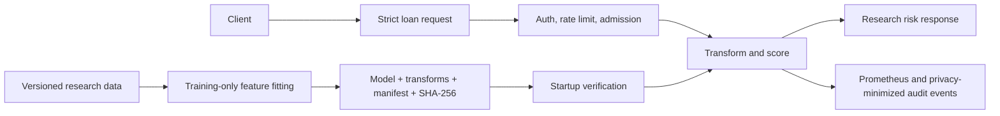

# Loan Default Risk Predictor

[](https://github.com/CoreyLeath-code/LoanDefaultRiskPredictor/actions/workflows/ci.yml)
[](LICENSE)

Loan Default Risk Predictor is a research-oriented LightGBM pipeline and model-backed FastAPI service. It demonstrates traceable model packaging, input validation, and serving controls for experimentation with loan-risk data.

> This repository is **not an approved credit-decision system**. Do not use it to make lending decisions without representative-data validation, fair-lending and calibration review, privacy and legal approval, human oversight, and environment-specific security controls.

## Implemented capabilities

- Leakage-conscious feature engineering, training-only fitted transformations, and identifier exclusion.
- A versioned model bundle with a SHA-256 manifest, threshold, policy version, dataset identifier, and training metadata.
- Model-backed `POST /predict`; serving starts only with a verified bundle in production.
- Strict loan-request validation and deterministic reason-code placeholders for research review.
- API-key support, in-process rate limiting, bounded concurrency, security headers, readiness, and Prometheus metrics.
- Feedback capture with a required timezone-aware observation timestamp.
- API, artifact-integrity, data-contract, metrics, and training-pipeline tests.

## Architecture



The supported service is [`api/inference_api.py`](api/inference_api.py). Training and bundle handling are implemented under [`src/`](src/).

## Quick start

Python 3.11 and 3.12 are the CI-supported versions.

```bash
python -m venv .venv
# macOS/Linux
. .venv/bin/activate
# Windows PowerShell: .\.venv\Scripts\Activate.ps1

python -m pip install --upgrade pip
python -m pip install -r requirements/dev.txt
python -m pytest -q
```

The CI-only bundle command makes a deterministic local artifact for API experiments; it is not a validated lending model.

```bash
python -m scripts.build_smoke_bundle --output models/ci
MODEL_BUNDLE_PATH=models/ci LOAN_RISK_API_KEY=local-dev \
  uvicorn api.inference_api:app --reload
```

In Windows PowerShell:

```powershell
python -m scripts.build_smoke_bundle --output models/ci
$env:MODEL_BUNDLE_PATH = "models/ci"
$env:LOAN_RISK_API_KEY = "local-dev"
uvicorn api.inference_api:app --reload
```

## API contract

| Endpoint | Purpose |
|---|---|
| `GET /healthz` | Process liveness |
| `GET /readyz` | Verified model-bundle readiness |
| `GET /metrics` | Prometheus exposition format |
| `POST /predict` | Model-backed research prediction |
| `POST /feedback` | Record an observed research outcome |

`POST /predict` requires the validated raw loan fields defined by [`LoanRequest`](api/schemas.py). Unknown fields are rejected. When `LOAN_RISK_API_KEY` is configured, pass it via `X-API-Key`. A successful response is a research signal with a model and policy version; it is not an approval, denial, or adverse-action notice.

`POST /feedback` accepts an outcome and an ISO 8601 timestamp with a timezone, for example `2026-07-22T00:00:00Z`. The service rejects malformed or timezone-naive timestamps so outcome records have unambiguous temporal context.

## Configuration

| Variable | Default | Purpose |
|---|---|---|
| `MODEL_BUNDLE_PATH` | `models/current` | Directory containing `manifest.json` and the checksummed model bundle. |
| `LOAN_RISK_API_KEY` | unset | Enables API-key validation; mandatory when `ENVIRONMENT=production`. |
| `ENVIRONMENT` | `development` | In production, missing or invalid model bundles fail startup. |

The model bundle contains joblib-serialized objects. Treat its source path as administrator-controlled and do not load untrusted artifacts.

## Verification and reproducibility

The CI workflow runs a Python 3.11/3.12 matrix with syntax checks, Ruff, mypy, Bandit, coverage enforcement, dependency audit, and a model-backed container readiness smoke test. It uploads coverage artifacts for each Python version.

Run the critical serving checks locally:

```bash
python -m pytest -q tests/test_api.py tests/test_artifacts.py
python -m compileall -q api src evaluation tests scripts
ruff check api src evaluation tests scripts
```

Training and evaluation commands are intentionally separate from serving because model performance must be evaluated against a versioned, representative dataset. See [`docs/MODEL_CARD.md`](docs/MODEL_CARD.md), [`docs/GOVERNANCE.md`](docs/GOVERNANCE.md), and [`metrics.md`](metrics.md) for research and governance context.

## Security and data boundaries

- Input schemas reject unknown fields and enforce physical bounds for request fields.
- Model checksum verification occurs before deserialization.
- API responses use `Cache-Control: no-store`; audit events omit raw borrower feature values.
- Rate limiting and concurrency admission are local controls; use a managed gateway for distributed enforcement.
- Never commit customer data, secrets, private keys, or real model artifacts.

## Limitations and next work

- No model-quality, fairness, or calibration claim is valid without a documented, representative evaluation dataset and independent review.
- Reason codes are deterministic placeholders and are not approved adverse-action reasons.
- The in-process rate limiter is unsuitable as the sole production abuse-control mechanism.
- Production use requires model-risk, fair-lending, privacy, security, and legal sign-off, plus monitored rollout and rollback procedures.

See the open audit work in [issue #12](https://github.com/CoreyLeath-code/LoanDefaultRiskPredictor/issues/12).

## License

MIT. See [LICENSE](LICENSE).
